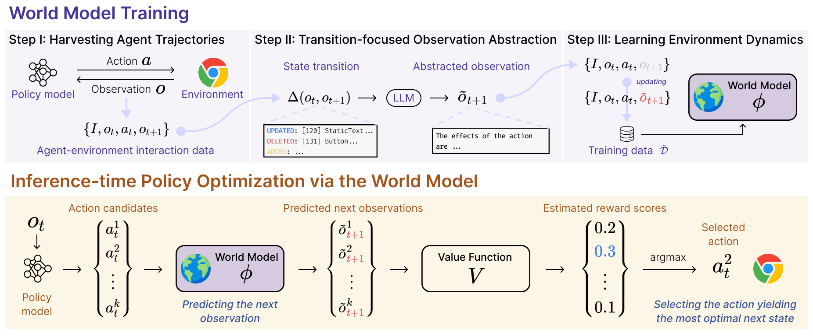

<!-- # 🐦 Magpie -->

<!-- [](https://magpie-align.github.io/) -->

[](https://arxiv.org/abs/2410.13232) [](https://opensource.org/licenses/MIT) [](https://huggingface.co/Magpie-Align) [](https://huggingface.co/spaces/LangAGI-Lab/WMA-Agent)

This is the official repository for ICLR 2025 paper "[Web Agents with World Models: Learning and Leveraging Environment Dynamics in Web Navigation](https://arxiv.org/abs/2410.13232)". We present a World-model-augmented (WMA) web agent that simulates action outcomes for better decision-making in long-horizon web tasks. Unlike existing LLM-based web agents that often make costly mistakes (e.g., repeatedly buying non-refundable tickets), our approach leverages world models to predict potential consequences before taking actions. We propose a transition-focused observation abstraction that enables effective training of LLMs as world models by focusing on natural language descriptions of important state changes. Experiments on WebArena and Mind2Web demonstrate that our world models improve agents' policy selection without training and show superior cost- and time-efficiency compared to tree-search-based approaches.

- 🤗 [**Huggingface (Models and Datasets)**](https://huggingface.co/spaces/LangAGI-Lab/WMA-Agent)
- 📄 [**Paper**](https://arxiv.org/abs/2406.08464)
- 🤗 [**WMA Agent Demo**](https://huggingface.co/spaces/hyungjoochae/WMA-Agent-Demo) (WIP)

## 🌍 News
- [2025/01/22] WMA Web Agent is accepted by ICLR 2025! 
- [2024/06/12] [WMA Web Agent]((https://arxiv.org/abs/2406.08464)) is out! 


## Models and Datasets

| Type | Name | Link |
|------|------|------|
| Model | World Model Adapter | [Meta-Llama-3.1-8B-Instruct-WM-webarena-16k-adapter](https://huggingface.co/LangAGI-Lab/Meta-Llama-3.1-8B-Instruct-WM-webarena-16k-adapter) |
| Model | Value Model Adapter | [Meta-Llama-3.1-8B-Instruct-value-model-16k-qlora-adapter-v2](https://huggingface.co/LangAGI-Lab/Meta-Llama-3.1-8B-Instruct-value-model-16k-qlora-adapter-v2) |
| Dataset | World Model Training | [world_model_for_wa_desc_with_tao_dataset](https://huggingface.co/datasets/LangAGI-Lab/world_model_for_wa_desc_with_tao_dataset) |
| Dataset | World Model Formatted | [world_model_for_wa_desc_with_tao_formatted_w_cot](https://huggingface.co/datasets/LangAGI-Lab/world_model_for_wa_desc_with_tao_formatted_w_cot) |
| Dataset | Value Model Test | [Mind2Web-cleaned-lite-value-model-w-cot-test](https://huggingface.co/datasets/LangAGI-Lab/Mind2Web-cleaned-lite-value-model-w-cot-test) |
| Dataset | Value Model Formatted Test | [Mind2Web-cleaned-lite-value-model-w-cot-formatted-test](https://huggingface.co/datasets/LangAGI-Lab/Mind2Web-cleaned-lite-value-model-w-cot-formatted-test) |


## Abstract
<details><summary>Click Here</summary>
Large language models (LLMs) have recently gained much attention in building autonomous agents. However, performance of current LLM-based web agents in long-horizon tasks is far from optimal, often yielding errors such as repeatedly buying a non-refundable flight ticket. By contrast, humans can avoid such an irreversible mistake, as we have an awareness of the potential outcomes (e.g., losing money) of our actions, also known as the "world model". Motivated by this, our study first starts with preliminary analyses, confirming the absence of world models in current LLMs (e.g., GPT-4o, Claude-3.5-Sonnet, etc.). Then, we present a World-model-augmented (WMA) web agent, which simulates the outcomes of its actions for better decision-making. To overcome the challenges in training LLMs as world models predicting next observations, such as repeated elements across observations and long HTML inputs, we propose a transition-focused observation abstraction, where the prediction objectives are free-form natural language descriptions exclusively highlighting important state differences between time steps. Experiments on WebArena and Mind2Web show that our world models improve agents' policy selection without training and demonstrate our agents' cost- and time-efficiency compared to recent tree-search-based agents.
</details><be>

## Overview



## Dataset Construction
The process of dataset construction includes following steps:
### Collecting Agent-Environment Interaction Data
First, we need to collect the agents' trajectories to collect the environment transition data. 
```
python run_for_trajectory.py
```
### Annotating the Transition-focused Observation
Then, to allow efficient training of the world model, we extract the difference between the current observation and the next observation.
```
python dataset_construction/annotation_for_tao_torch.py
```

And, we convert the extracted difference to descriptive format.

```
python dataset_construction/annotation_for_description_with_tao.py
```

Finally, we processing the dataset for training.

```
python dataset_construction/format_dataset_and_split.py
```

## World Model Training
We use axolotl framework for finetuning our world models. We will upload the train configuration soon.

## Inference with the World Model
Please note that our code base for inference is largely motivated by [search-agents](https://github.com/kohjingyu/search-agents). Also, you have to setup docker environment to run experiments on WebArena. Please refer to [WebArena](https://github.com/web-arena-x/webarena) to setup the environment. To run inference, execute the command below.

```
bash scripts/parallel_run_webarena_wma.sh
```

## Citation

```
@inproceedings{
chae2025web,
title={Web Agents with World Models: Learning and Leveraging Environment Dynamics in Web Navigation},
author={Hyungjoo Chae and Namyoung Kim and Kai Tzu-iunn Ong and Minju Gwak and Gwanwoo Song and Jihoon Kim and Sunghwan Kim and Dongha Lee and Jinyoung Yeo},
booktitle={The Thirteenth International Conference on Learning Representations},
year={2025},
url={https://openreview.net/forum?id=moWiYJuSGF}
}
```
